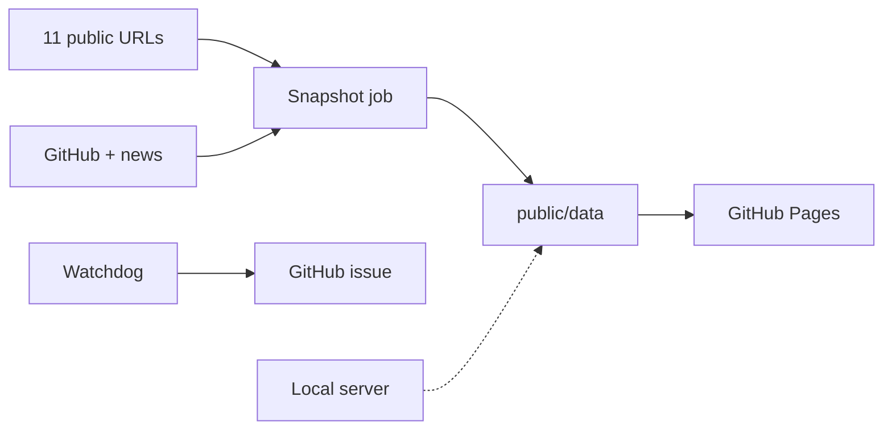

<p align="center"><em>Studio banner for this public repo. The picture is illustration only — not a screenshot of NON.OS, not live telemetry, and not a claim about cameras or a physical operations room.</em></p>

# Dr Non’s Operating Systems

**A snapshot-fed watchboard for the civic sites one person actually ships — Thai / English, one Mac.**

[](LICENSE)
[](package.json)

**Live:** [nonarkara.github.io/dr-non-operating-systems](https://nonarkara.github.io/dr-non-operating-systems/) · **Repo:** [Nonarkara/dr-non-operating-systems](https://github.com/Nonarkara/dr-non-operating-systems)

By [Non Arkaraprasertkul](https://github.com/Nonarkara) ([@Nonarkara](https://github.com/Nonarkara)) — civic studio practice of **Axiom X Co., Ltd.**, Bangkok.

The npm package name is `non-operations-radar` (v3.0.0). There is no framework and no bundler: vanilla HTML, CSS, and JavaScript, plus a single Node server.

---

## What this is

A **public operations dashboard** (NON.OS) that watches a **fixed list of 11 deployed URLs**, shows GitHub activity for this account, and surfaces recent public mentions in two locales (Global/US and Thailand). The same page also carries a profile, a local-target registry, and an archives layer (origin story, field notes, a linked serial).

What visitors see is **not a live probe from their browser**. GitHub Pages serves the static tree under `public/`. A scheduled GitHub Action scans the targets and writes JSON under `public/data/`. The dashboard reads those files.

| Surface | Role |
| --- | --- |
| GitHub Pages (`public/`) | The public site. Reads `public/data/*.json`. |
| Snapshot workflow | Cron at `:17` past every even hour UTC. Writes the JSON the page displays. |
| Watchdog workflow | Every 30 minutes, `curl`s the same 11 URLs and opens (or updates) a `watchdog` issue on failure. |
| Optional Node server (`server.js`) | Local scanner, scheduler, and admin API. The public Pages site does **not** call it. |

The five tabs in `public/index.html` are **Systems**, **Intelligence**, **Profile**, **Registry**, and **Archives**.

The monitored list lives in `TARGETS` inside `server.js` and is duplicated in `.github/workflows/watchdog.yml`. Those two must stay in sync.

This is **not** a general-purpose operating system, not a knowledge wiki, and not a published monograph. Archive copy sits *on* the dashboard; the running system is the monitoring app.

---

## Philosophy

Fork the **method**, not the secrets. The useful thing here is the split: a static page the world can open, a cron that writes honest JSON, and a watchdog that does not depend on a private host. API tokens, webhook URLs, and database keys are not part of the public claim. If a number cannot be shown from a committed snapshot or a public URL, it does not belong on this board.

Serious civic systems should run on **one Mac / one person**. This repo has no npm package dependencies. Node 22, three scripts (`start`, `smoke`, `snapshot`), and the files in `public/`. You do not need a data centre or a vendor platform to read the board or stand up a local copy.

There is **no black-box ranking**. This is a watchboard, not a city index. A target is up, down, or the last snapshot said so. The frontend does not invent a league table. If a scan cannot reach the network, `scripts/write-dashboard-snapshot.mjs` **keeps the previous snapshot** instead of publishing a wall of “offline.” That is a feature.

The audience is **bilingual Thai–English**. Mentions are swept in both locales (`US:en` and `TH:th` in `server.js`). The dashboard copy is English-first so forks worldwide can run it; the Thai public sites it watches stay Thai where they are Thai.

Honesty labels matter more than a glossy “live” badge. On GitHub Pages you are looking at a **scheduled snapshot**. Live API responses from `server.js` are only served when the request host looks local (localhost, `.local`, or RFC1918). Everywhere else, the on-disk JSON wins.

---

## Ethical use

This is **independent studio software**. It is not an official product of depa, ASEAN, a municipality, or Axiom’s clients unless a later document **in this repository** says so in plain language. Partner logos and portraits under `public/` record *this* studio’s work. They are not a gazette.

**Do**

- Treat the Pages site as a **snapshot**. Quote `generatedAt` from `public/data/dashboard-snapshot.json` if you cite a number.
- Keep credentials in the operator’s environment (`.env` is gitignored). Name the variables; never paste values into issues, PRs, or this README.
- Attribute the **watched sites**. Each target is its own project with its own license. Linking to it from this board is not a relicense.
- Use the watchdog to watch **your** public URLs. Adding a hostname is a line in two files, not a licence to scan other people’s networks.
- Keep the previous snapshot when the whole network looks down. Do not “fix” that guard.

**Do not**

- Present this repo as a government operations centre, a warning issuer, or a live SOC.
- Quote the banner as a screenshot, a camera wall, or production telemetry.
- Commit `GITHUB_TOKEN`, `SUPABASE_SERVICE_KEY`, webhook URLs, or any other secret.
- Ship mock uptime as live, or hide an empty feed behind a green badge.
- Imply that MIT on this scanner grants rights in news snippets, GitHub metadata, portraits, résumés, or the fiction and papers linked from Archives.

If a contribution would only work by pasting a secret, it does not belong here.

---

## How to use / learn

You can learn the pattern without standing up infrastructure.

1. **Read the public board.** Open [the live dashboard](https://nonarkara.github.io/dr-non-operating-systems/). You are reading the latest committed snapshot, not a live probe from your browser.
2. **Read the data contract.** After a clone, open `public/index.html`. The UI loads `public/data/*.json` beside the page. Stale JSON is expected if you have not run a snapshot. Changing those shapes without updating `public/app.js` will break the page.
3. **Run it on one machine.** Requires [Node.js](https://nodejs.org/) 22. There are no packages to install.

```bash
git clone https://github.com/Nonarkara/dr-non-operating-systems.git
cd dr-non-operating-systems
npm start
```

The server listens on `http://127.0.0.1:4178` by default (`HOST` / `PORT` override that). Live API responses are only served when the request host looks local; otherwise the on-disk snapshot is returned.

| Command | What it does |
| --- | --- |
| `npm start` | Run the scanner and serve `public/` |
| `npm run smoke` | Boot without a long-lived port, then check `/api/health`, `/api/dashboard`, the snapshot file, and `index.html` |
| `npm run snapshot` | Scan all targets, fetch GitHub profile/repos/mentions, write `public/data/*.json` (and optionally flush to Supabase). Rewrites those files; do not commit them unless you mean to. |

Smoke is what the Pages deploy workflow runs first. Snapshot is what the scheduled workflow runs.

Optional environment variables — **names only**. Put values in a local `.env` or your host’s secret store, never in git:

| Variable | Used for |
| --- | --- |
| `GITHUB_TOKEN` / `GH_TOKEN` / `GITHUB_API_TOKEN` | GitHub profile, repos, and activity |
| `SUPABASE_URL` plus `SUPABASE_SERVICE_KEY` or `SUPABASE_ANON_KEY` | Optional long-term tables (`supabase/migrations/`) |
| `ALERT_WEBHOOK_URL` | Downtime webhook |
| `SHEETS_WEBHOOK_URL` | Optional spreadsheet logging |
| `NO_LISTEN=1` | Import `server.js` without opening a port (smoke and snapshot) |

To **fork the method**, copy the split (static `public/` + a cron that writes JSON + a watchdog that curls URLs). Change the 11 targets to *your* public sites. Do not keep this studio’s portraits, partner lockup, or “NON.OS” name on a board you have pointed at someone else’s fleet.

---

## System diagram

Short labels so GitHub does not clip the chart.



The 11 URLs are the `TARGETS` array in `server.js` (War Monitor, MEM by NON, SLIC Index 2026, Sabai Sabai, City Tech Atlas, SCL Landing Page, RAAT, Tech Hunt Thailand / Viabus, ASCN Smart Cities Network, ASEAN CSCO App, Kuching IOC). The watchdog map must list the same set.

---

## License / contributing

The **source** in this repository (the Node scanner, workflows, SQL migrations, and dashboard HTML/CSS/JS) is licensed under the [MIT License](LICENSE). Copyright © 2026 **Non Arkaraprasertkul / Axiom X Co., Ltd.**

MIT does **not** cover everything in the tree or everything the dashboard displays:

- Sites in the monitored list remain their own projects, with their own licenses.
- GitHub profile/repo metadata and news-mention snippets are third-party data, fetched for display.
- Screenshots, logos, portraits, résumé files, and other media under `public/` are not licensed as MIT just because they sit next to the app.
- Linked academic papers, essays, and serialized fiction keep the rights of their publishers and authors.
- The hero banner (`docs/hero-banner.png`) is studio illustration for this README, not a data product.

Reuse this project’s code under MIT. Treat media, writing, and third-party data as someone else’s unless you have a separate grant.

**Contributions.** Open a pull request against `main`. Keep the voice factual. Prefer a method change (clearer snapshot contract, a missing target kept in sync in both files, a smoke assertion) over a restyle. Do not commit rewritten `public/data/*.json` unless the change *is* the snapshot. Do not add secrets. Run `npm run smoke` before you push — Pages deploy will block on it anyway.

If you build your own watchboard from this split, say so, and leave this studio’s name off the masthead.
